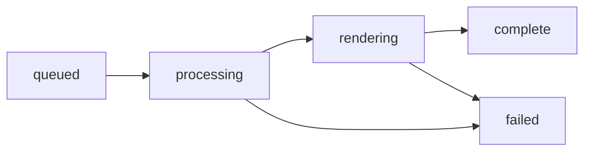

The Render API combines a character and scene to generate an animated video. Two rendering workflows are available based on your needs.

## Rendering Modes

<CardGroup cols={2}>
  <Card title="Live Render" icon="bolt" color="#c8ff00">
    Use the **Poll endpoint** with long-polling. Returns video chunks progressively as they're rendered.
    
    **Best for:**
    - Real-time preview
    - Progressive playback
    - Streaming applications
  </Card>
  <Card title="Batch Render" icon="layer-group" color="#a855f7">
    Use the **Status endpoint** to check progress. Download the complete video when status is `complete`.
    
    **Best for:**
    - Background processing
    - File downloads
    - Simple integration
  </Card>
</CardGroup>

## Job Status Flow

Jobs progress through the following statuses:



| Status | Description |
|--------|-------------|
| `queued` | Job is waiting in the queue |
| `processing` | Job is being prepared |
| `rendering` | Video frames are being generated |
| `complete` | Video is ready for download |
| `failed` | Job failed (check `error` field) |

## Workflow Comparison

<Tabs>
  <Tab title="Live Render">
    ```python
    # Long-poll for chunks as they render
    last_chunk = -1
    while True:
        resp = requests.get(
            f"{BASE}/api/render/{job_id}/poll",
            params={"after": last_chunk, "timeout": 30}
        ).json()
        
        # Play new chunks immediately
        for chunk in resp["chunks"]:
            play_video_chunk(chunk["url"])
            last_chunk = max(last_chunk, chunk["index"])
        
        if resp["status"] == "complete":
            break
    ```
  </Tab>
  <Tab title="Batch Render">
    ```python
    # Poll status until complete
    while True:
        status = requests.get(
            f"{BASE}/api/render/{job_id}"
        ).json()
        
        if status["status"] == "complete":
            # Download full video
            video = requests.get(
                f"{BASE}/api/render/{job_id}/video"
            )
            save_video(video.content)
            break
        
        time.sleep(5)
    ```
  </Tab>
</Tabs>

## Quick Links

<CardGroup cols={2}>
  <Card title="Create Render Job" icon="play" href="/api-reference/render/create">
    Start a single-character render
  </Card>
  <Card title="Multi-Character Render" icon="users" href="/api-reference/render/multi-character">
    Render multiple people with different avatars
  </Card>
  <Card title="Poll for Chunks" icon="bolt" href="/api-reference/render/poll">
    Live render with progressive chunks
  </Card>
  <Card title="Get Job Status" icon="chart-simple" href="/api-reference/render/status">
    Check batch render progress
  </Card>
</CardGroup>
