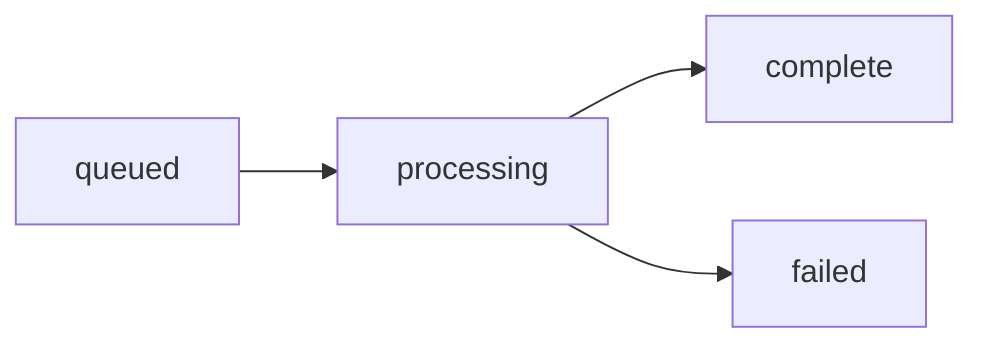

The Render API combines a character and scene to generate an animated video. Submit a render job, poll the status endpoint until complete, and download the final video from the `cdn_url`.

## Job Status Flow

Jobs progress through the following statuses:


```mermaid
graph LR
    A[queued] --> B[processing]
    B --> C[complete]
    B --> D[failed]
```

| Status | Description |
|--------|-------------|
| `queued` | Job is waiting in the queue |
| `processing` | Pipeline is running (check `progress_pct` and `checkpoint` for stage) |
| `complete` | Video is ready -- use `cdn_url` to download |
| `failed` | Job failed (check `error_code` and `error_message` fields) |
| `cancelled` | Job was cancelled via `DELETE /api/render/{job_id}` |

## Polling Example

```python
import requests, time

API_KEY, BASE = "YOUR_API_KEY", "https://apis.viggle.ai"
headers = {"Authorization": f"Bearer {API_KEY}"}

# Create render job
job = requests.post(f"{BASE}/api/render", headers=headers, data={
    "character_id": "char_xxx",
    "scene_id": "scene_xxx",
}).json()

# Poll until complete (no auth required)
while True:
    status = requests.get(f"{BASE}/api/render/{job['job_id']}").json()
    print(f"Status: {status['status']} ({status.get('progress_pct', 0)}%)")
    if status["status"] == "complete":
        print(f"Video: {status['cdn_url']}")
        break
    elif status["status"] == "failed":
        raise Exception(f"{status.get('error_code')}: {status.get('error_message')}")
    time.sleep(3)

# Download
video = requests.get(status["cdn_url"])
open("output.mp4", "wb").write(video.content)
```

## Quick Links

<CardGroup cols={2}>
  <Card title="Create Render Job" icon="play" href="/api-reference/render/create">
    Start a single-character render
  </Card>
  <Card title="Multi-Character Render" icon="users" href="/api-reference/render/multi-character">
    Render multiple people with different avatars
  </Card>
  <Card title="Get Job Status" icon="chart-column" href="/api-reference/render/status">
    Check render progress (no auth required)
  </Card>
  <Card title="Cancel Job" icon="xmark" href="/api-reference/render/cancel">
    Cancel a running job and refund credits
  </Card>
  <Card title="On-Demand Guide" icon="zap" href="/guides/on-demand">
    Render without preprocessing -- one API call
  </Card>
  <Card title="Import Templates" icon="download" href="/guides/import-templates">
    Find and import pre-made scenes from viggle.ai
  </Card>
</CardGroup>
