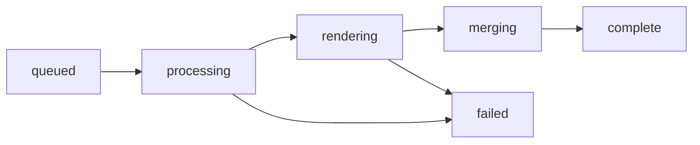

The Render API combines a character and scene to generate an animated video. Use the **Poll endpoint** with long-polling to receive video chunks progressively as they render, or check the **Status endpoint** and download the complete video when ready.

## Job Status Flow

Jobs progress through the following statuses:


```mermaid
graph LR
    A[queued] --> B[processing]
    B --> C[rendering]
    C --> D[merging]
    D --> E[complete]
    C --> F[failed]
    B --> F
```

| Status | Description |
|--------|-------------|
| `queued` | Job is waiting in the queue |
| `processing` | Job is being prepared |
| `rendering` | Video frames are being generated |
| `merging` | All chunks rendered, final video is being assembled |
| `complete` | Video is ready for download |
| `failed` | Job failed (check `error` field) |

## Quick Start: Full Render Flow

Submit a render job, poll until complete, and download the video.

<CodeGroup>
```python Python
import requests
import time

BASE = "https://apis.viggle.ai"
headers = {"Authorization": "Bearer YOUR_API_KEY"}

# 1. Submit render job (on-demand with file uploads)
with open("character.png", "rb") as img, open("driving.mp4", "rb") as vid:
    resp = requests.post(
        f"{BASE}/api/render",
        headers=headers,
        files={
            "ref_image": ("character.png", img, "image/png"),
            "driving_video": ("driving.mp4", vid, "video/mp4"),
        },
        data={"background_mode": "original"},
    ).json()

if "detail" in resp:
    raise Exception(f"Error {resp['detail']['error_code']}: {resp['detail']['message']}")

job_id = resp["job_id"]
print(f"Job created: {job_id}")

# 2. Poll for status
while True:
    status = requests.get(f"{BASE}/api/render/{job_id}", headers=headers).json()
    print(f"Status: {status['status']} ({status.get('progress', {}).get('percent', 0)}%)")

    if status["status"] == "complete":
        break
    elif status["status"] == "failed":
        raise Exception(f"Error {status.get('error_code')}: {status.get('error')}")

    time.sleep(5)

# 3. Download the video
video = requests.get(
    f"{BASE}/api/render/{job_id}/download",
    headers=headers,
    allow_redirects=True,
    stream=True,
)
with open("output.mp4", "wb") as f:
    for chunk in video.iter_content(chunk_size=8192):
        f.write(chunk)

print("Saved output.mp4")
```

```javascript JavaScript
const BASE = "https://apis.viggle.ai";
const headers = { "Authorization": "Bearer YOUR_API_KEY" };

// 1. Submit render job (on-demand with file uploads)
const form = new FormData();
form.append("ref_image", await fetch("character.png").then(r => r.blob()), "character.png");
form.append("driving_video", await fetch("driving.mp4").then(r => r.blob()), "driving.mp4");
form.append("background_mode", "original");

let resp = await fetch(`${BASE}/api/render`, {
  method: "POST",
  headers,
  body: form,
});
let data = await resp.json();

if (data.detail) {
  throw new Error(`Error ${data.detail.error_code}: ${data.detail.message}`);
}

const jobId = data.job_id;
console.log(`Job created: ${jobId}`);

// 2. Poll for status
while (true) {
  const status = await fetch(`${BASE}/api/render/${jobId}`, { headers }).then(r => r.json());
  console.log(`Status: ${status.status} (${status.progress?.percent ?? 0}%)`);

  if (status.status === "complete") break;
  if (status.status === "failed") {
    throw new Error(`Error ${status.error_code}: ${status.error}`);
  }

  await new Promise(r => setTimeout(r, 5000));
}

// 3. Download the video
const video = await fetch(`${BASE}/api/render/${jobId}/download`, { headers });
const blob = await video.blob();
const fs = await import("fs");
fs.writeFileSync("output.mp4", Buffer.from(await blob.arrayBuffer()));
console.log("Saved output.mp4");
```

```bash cURL
# 1. Submit render job
JOB=$(curl -s -X POST "https://apis.viggle.ai/api/render" \
  -H "Authorization: Bearer YOUR_API_KEY" \
  -F "ref_image=@character.png" \
  -F "driving_video=@driving.mp4" \
  -F "background_mode=original")

JOB_ID=$(echo "$JOB" | jq -r '.job_id')
echo "Job created: $JOB_ID"

# 2. Poll for status
while true; do
  STATUS=$(curl -s "https://apis.viggle.ai/api/render/$JOB_ID" -H "Authorization: Bearer YOUR_API_KEY")
  STATE=$(echo "$STATUS" | jq -r '.status')
  echo "Status: $STATE"

  if [ "$STATE" = "complete" ]; then break; fi
  if [ "$STATE" = "failed" ]; then
    echo "Error: $(echo "$STATUS" | jq -r '.error_code'): $(echo "$STATUS" | jq -r '.error')"
    exit 1
  fi
  sleep 5
done

# 3. Download the video
curl -L -o output.mp4 \
  -H "Authorization: Bearer YOUR_API_KEY" \
  "https://apis.viggle.ai/api/render/$JOB_ID/download"

echo "Saved output.mp4"
```
</CodeGroup>

## Live Render Example

Long-poll for fMP4 chunks as they render for progressive playback.

<CodeGroup>
```python Python
import requests

BASE = "https://apis.viggle.ai"
headers = {"Authorization": "Bearer YOUR_API_KEY"}
job_id = "job_abc123xyz"
last_chunk = -1

while True:
    resp = requests.get(
        f"{BASE}/api/render/{job_id}/poll",
        headers=headers,
        params={"last_chunk": last_chunk, "timeout": 30}
    ).json()

    if resp.get("error_code"):
        print(f"Error {resp['error_code']}: {resp.get('error')}")
        break

    for chunk in resp.get("new_chunks", []):
        print(f"Playing chunk {chunk['chunk_id']}")
        # play_video_chunk(chunk["cdn_url"])
        last_chunk = max(last_chunk, chunk["chunk_id"])

    if resp["status"] == "complete":
        break
```

```javascript JavaScript
const BASE = "https://apis.viggle.ai";
const headers = { "Authorization": "Bearer YOUR_API_KEY" };
const jobId = "job_abc123xyz";
let lastChunk = -1;

while (true) {
  const params = new URLSearchParams({ last_chunk: lastChunk, timeout: 30 });
  const resp = await fetch(`${BASE}/api/render/${jobId}/poll?${params}`, { headers });
  const data = await resp.json();

  if (data.error_code) {
    console.error(`Error ${data.error_code}: ${data.error}`);
    break;
  }

  for (const chunk of data.new_chunks || []) {
    console.log(`Playing chunk ${chunk.chunk_id}`);
    // appendToMediaSource(chunk.cdn_url);
    lastChunk = Math.max(lastChunk, chunk.chunk_id);
  }

  if (data.status === "complete") break;
}
```

```bash cURL
# Long-poll for chunks (blocks up to 30s)
curl "https://apis.viggle.ai/api/render/job_abc123xyz/poll?last_chunk=-1&timeout=30" \
  -H "Authorization: Bearer YOUR_API_KEY"
```
</CodeGroup>

## Quick Links

<CardGroup cols={2}>
  <Card title="Create Render Job" icon="play" href="/api-reference/render/create">
    Start a single-character render
  </Card>
  <Card title="Multi-Character Render" icon="users" href="/api-reference/render/multi-character">
    Render multiple people with different avatars
  </Card>
  <Card title="Poll for Chunks" icon="zap" href="/api-reference/render/poll">
    Live render with progressive chunks
  </Card>
  <Card title="Get Job Status" icon="chart-column" href="/api-reference/render/status">
    Check render progress
  </Card>
  <Card title="Download Video" icon="download" href="/api-reference/render/download">
    Download completed video
  </Card>
  <Card title="Live Streaming Guide" icon="radio" href="/guides/live-render">
    Stream fMP4 chunks with MSE or long-polling
  </Card>
  <Card title="fMP4 Format Spec" icon="file-video" href="/guides/fmp4-format">
    Technical details of the fragmented MP4 chunk format
  </Card>
  <Card title="Import Templates" icon="download" href="/guides/import-templates">
    Find and import pre-made scenes from viggle.ai
  </Card>
</CardGroup>
