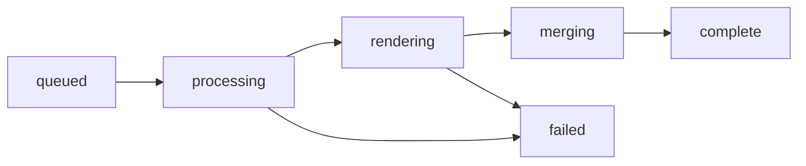

The Render API combines a character and scene to generate an animated video. Use the **Poll endpoint** with long-polling to receive video chunks progressively as they render, or check the **Status endpoint** and download the complete video when ready.

## Job Status Flow

Jobs progress through the following statuses:


```mermaid
graph LR
    A[queued] --> B[processing]
    B --> C[rendering]
    C --> D[merging]
    D --> E[complete]
    C --> F[failed]
    B --> F
```

| Status | Description |
|--------|-------------|
| `queued` | Job is waiting in the queue |
| `processing` | Job is being prepared |
| `rendering` | Video frames are being generated |
| `merging` | All chunks rendered, final video is being assembled |
| `complete` | Video is ready for download |
| `failed` | Job failed (check `error` field) |

## Live Render Example

```python
# Long-poll for chunks as they render
last_chunk = -1
while True:
    resp = requests.get(
        f"{BASE}/api/render/{job_id}/poll",
        headers=headers,
        params={"last_chunk": last_chunk, "timeout": 30}
    ).json()

    # Play new chunks immediately
    for chunk in resp["new_chunks"]:
        play_video_chunk(chunk["cdn_url"])
        last_chunk = max(last_chunk, chunk["chunk_id"])

    if resp["status"] == "complete":
        break
```

## Quick Links

<CardGroup cols={2}>
  <Card title="Create Render Job" icon="play" href="/api-reference/render/create">
    Start a single-character render
  </Card>
  <Card title="Multi-Character Render" icon="users" href="/api-reference/render/multi-character">
    Render multiple people with different avatars
  </Card>
  <Card title="Poll for Chunks" icon="bolt" href="/api-reference/render/poll">
    Live render with progressive chunks
  </Card>
  <Card title="Get Job Status" icon="chart-simple" href="/api-reference/render/status">
    Check render progress (no auth)
  </Card>
  <Card title="Download Video" icon="download" href="/api-reference/render/download">
    Download completed video (+ mask for transparent mode)
  </Card>
  <Card title="Live Streaming Guide" icon="signal-stream" href="/guides/live-render">
    Stream fMP4 chunks with MSE or long-polling
  </Card>
  <Card title="fMP4 Format Spec" icon="file-video" href="/guides/fmp4-format">
    Technical details of the fragmented MP4 chunk format
  </Card>
  <Card title="Import Templates" icon="download" href="/guides/import-templates">
    Find and import pre-made scenes from viggle.ai
  </Card>
</CardGroup>
