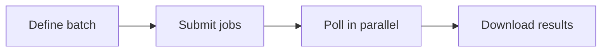

Submit multiple render jobs at once and process them in parallel.



## Workflow

<Steps>
  <Step title="Submit jobs" icon="upload">
    Submit multiple jobs without waiting for each to complete:

    ```python
    import requests, time
    from concurrent.futures import ThreadPoolExecutor, as_completed

    API_KEY, BASE = "YOUR_API_KEY", "https://apis.viggle.ai"
    headers = {"Authorization": f"Bearer {API_KEY}"}

    renders = [
        {"character_id": "char_alice", "scene_id": "scene_dance"},
        {"character_id": "char_bob",   "scene_id": "scene_dance"},
        {"character_id": "char_alice", "scene_id": "scene_walk"},
        {"character_id": "char_carol", "scene_id": "scene_run"},
    ]

    jobs = []
    for render in renders:
        job = requests.post(f"{BASE}/api/render", headers=headers, data=render).json()
        jobs.append({"job_id": job["job_id"], **render})
        print(f"Submitted: {job['job_id']}")
    ```
  </Step>

  <Step title="Poll and download" icon="download">
    Poll all jobs concurrently and download as they complete:

    ```python
    def wait_and_download(job_info):
        job_id = job_info["job_id"]
        while True:
            status = requests.get(f"{BASE}/api/render/{job_id}").json()
            if status["status"] == "complete": break
            elif status["status"] == "failed":
                return {"job_id": job_id, "error": status.get("error")}
            time.sleep(5)

        video = requests.get(f"{BASE}/api/render/{job_id}/download", headers=headers)
        filename = f"{job_info['character_id']}_{job_info['scene_id']}.mp4"
        open(filename, "wb").write(video.content)
        return {"job_id": job_id, "filename": filename}

    with ThreadPoolExecutor(max_workers=5) as pool:
        futures = {pool.submit(wait_and_download, j): j for j in jobs}
        for future in as_completed(futures):
            result = future.result()
            if "error" in result: print(f"FAILED {result['job_id']}: {result['error']}")
            else: print(f"Downloaded: {result['filename']}")
    ```
  </Step>

  <Step title="Multi-character batch" icon="users">
    Render the same multi-person scene with different character combinations:

    ```python
    import json

    SCENE_ID = "scene_group_dance"
    combinations = [
        {"person_a": "char_alice", "person_b": "char_bob"},
        {"person_a": "char_carol", "person_b": "char_dave"},
    ]

    for i, mapping in enumerate(combinations):
        job = requests.post(f"{BASE}/api/render", headers=headers, data={
            "scene_id": SCENE_ID,
            "character_mapping": json.dumps(mapping),
        }).json()
        print(f"Combo {i+1}: {job['job_id']}")
    ```
  </Step>
</Steps>

## Job management

<AccordionGroup>
  <Accordion title="Check all job statuses">
    ```python
    def check_batch_status(job_ids):
        results = {"queued": 0, "processing": 0, "rendering": 0, "complete": 0, "failed": 0}
        for job_id in job_ids:
            status = requests.get(f"{BASE}/api/render/{job_id}").json()
            results[status["status"]] += 1
        return results

    while True:
        counts = check_batch_status([j["job_id"] for j in jobs])
        print(counts)
        if counts["complete"] + counts["failed"] == len(jobs): break
        time.sleep(10)
    ```
  </Accordion>

  <Accordion title="Cancel all pending jobs">
    ```python
    for j in jobs:
        status = requests.get(f"{BASE}/api/render/{j['job_id']}").json()
        if status["status"] not in ("complete", "failed"):
            requests.delete(f"{BASE}/api/render/{j['job_id']}", headers=headers)
            print(f"Cancelled: {j['job_id']}")
    ```
  </Accordion>

  <Accordion title="Complete batch script">
    ```python
    import requests, time, json
    from concurrent.futures import ThreadPoolExecutor, as_completed

    API_KEY, BASE = "YOUR_API_KEY", "https://apis.viggle.ai"
    headers = {"Authorization": f"Bearer {API_KEY}"}

    def render_and_download(character_id, scene_id, output_name):
        job = requests.post(f"{BASE}/api/render", headers=headers, data={
            "character_id": character_id, "scene_id": scene_id,
        }).json()
        job_id = job["job_id"]
        while True:
            status = requests.get(f"{BASE}/api/render/{job_id}").json()
            if status["status"] == "complete": break
            elif status["status"] == "failed":
                raise Exception(f"Job {job_id} failed: {status.get('error')}")
            time.sleep(5)
        video = requests.get(f"{BASE}/api/render/{job_id}/download", headers=headers)
        open(f"{output_name}.mp4", "wb").write(video.content)
        return f"{output_name}.mp4"

    batch = [
        ("char_alice", "scene_dance", "alice_dance"),
        ("char_bob", "scene_dance", "bob_dance"),
        ("char_alice", "scene_walk", "alice_walk"),
    ]

    with ThreadPoolExecutor(max_workers=5) as pool:
        futures = {pool.submit(render_and_download, *a): a[2] for a in batch}
        for f in as_completed(futures):
            try: print(f"Done: {f.result()}")
            except Exception as e: print(f"Failed: {futures[f]} - {e}")
    ```
  </Accordion>
</AccordionGroup>

## Tips

<AccordionGroup>
  <Accordion title="Respect rate limits">
    Space submissions with a short delay, or submit in batches of 5-10. Don't submit hundreds simultaneously.
  </Accordion>
  <Accordion title="Use fast mode for time-sensitive batches">
    Enable `fast=true` on each job for faster rendering when capacity is available.
  </Accordion>
  <Accordion title="Handle failures gracefully">
    Always check for `failed` status. Retry failed jobs once with a short delay.
  </Accordion>
</AccordionGroup>

## What's next?

<CardGroup cols={2}>
  <Card title="On-Demand Rendering" icon="zap" href="/guides/on-demand">
    Render without preprocessing
  </Card>
  <Card title="Preprocessing Guide" icon="rocket" href="/guides/quickstart">
    Pre-create assets for 3x faster renders
  </Card>
  <Card title="Live Rendering" icon="radio" href="/guides/live-render">
    Stream video chunks in real-time
  </Card>
  <Card title="Render Options" icon="gauge" href="/render-options">
    Background mode, fast mode, and more
  </Card>
</CardGroup>
