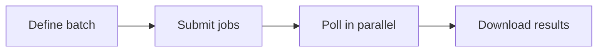

Submit multiple render jobs at once and process them in parallel.



## Workflow

<Steps>
  <Step title="Submit jobs" icon="upload">
    Submit multiple jobs without waiting for each to complete:

    <CodeGroup>

    ```python Python
    import requests, time
    from concurrent.futures import ThreadPoolExecutor, as_completed

    API_KEY, BASE = "YOUR_API_KEY", "https://apis.viggle.ai"
    headers = {"Authorization": f"Bearer {API_KEY}"}

    renders = [
        {"character_id": "char_alice", "scene_id": "scene_dance"},
        {"character_id": "char_bob",   "scene_id": "scene_dance"},
        {"character_id": "char_alice", "scene_id": "scene_walk"},
        {"character_id": "char_carol", "scene_id": "scene_run"},
    ]

    jobs = []
    for render in renders:
        job = requests.post(f"{BASE}/api/render", headers=headers, data=render).json()
        jobs.append({"job_id": job["job_id"], **render})
        print(f"Submitted: {job['job_id']}")
    ```

    ```javascript JavaScript
    const API_KEY = "YOUR_API_KEY", BASE = "https://apis.viggle.ai";
    const headers = { Authorization: `Bearer ${API_KEY}` };

    const renders = [
      { character_id: "char_alice", scene_id: "scene_dance" },
      { character_id: "char_bob",   scene_id: "scene_dance" },
      { character_id: "char_alice", scene_id: "scene_walk" },
      { character_id: "char_carol", scene_id: "scene_run" },
    ];

    const jobs = [];
    for (const render of renders) {
      const form = new URLSearchParams(render);
      const job = await fetch(`${BASE}/api/render`, {
        method: "POST", headers, body: form
      }).then(r => r.json());
      jobs.push({ job_id: job.job_id, ...render });
      console.log(`Submitted: ${job.job_id}`);
    }
    ```

    ```bash cURL
    # Submit each job sequentially and capture job IDs
    curl -X POST "https://apis.viggle.ai/api/render" \
      -H "Authorization: Bearer YOUR_API_KEY" \
      -d "character_id=char_alice" -d "scene_id=scene_dance"

    curl -X POST "https://apis.viggle.ai/api/render" \
      -H "Authorization: Bearer YOUR_API_KEY" \
      -d "character_id=char_bob" -d "scene_id=scene_dance"

    curl -X POST "https://apis.viggle.ai/api/render" \
      -H "Authorization: Bearer YOUR_API_KEY" \
      -d "character_id=char_alice" -d "scene_id=scene_walk"

    curl -X POST "https://apis.viggle.ai/api/render" \
      -H "Authorization: Bearer YOUR_API_KEY" \
      -d "character_id=char_carol" -d "scene_id=scene_run"
    # Each returns: { "job_id": "...", ... }
    ```

    </CodeGroup>
  </Step>

  <Step title="Poll and download" icon="download">
    Poll all jobs concurrently and download as they complete:

    <CodeGroup>

    ```python Python
    def wait_and_download(job_info):
        job_id = job_info["job_id"]
        while True:
            status = requests.get(f"{BASE}/api/render/{job_id}").json()
            if status["status"] == "complete": break
            elif status["status"] == "failed":
                return {"job_id": job_id, "error": status.get("error")}
            time.sleep(5)

        video = requests.get(f"{BASE}/api/render/{job_id}/download", headers=headers)
        filename = f"{job_info['character_id']}_{job_info['scene_id']}.mp4"
        open(filename, "wb").write(video.content)
        return {"job_id": job_id, "filename": filename}

    with ThreadPoolExecutor(max_workers=5) as pool:
        futures = {pool.submit(wait_and_download, j): j for j in jobs}
        for future in as_completed(futures):
            result = future.result()
            if "error" in result: print(f"FAILED {result['job_id']}: {result['error']}")
            else: print(f"Downloaded: {result['filename']}")
    ```

    ```javascript JavaScript
    const fs = require("fs");
    const sleep = (ms) => new Promise(r => setTimeout(r, ms));

    async function waitAndDownload(jobInfo) {
      const { job_id, character_id, scene_id } = jobInfo;
      while (true) {
        const status = await fetch(`${BASE}/api/render/${job_id}`).then(r => r.json());
        if (status.status === "complete") break;
        if (status.status === "failed") return { job_id, error: status.error };
        await sleep(5000);
      }

      const video = await fetch(`${BASE}/api/render/${job_id}/download`, { headers });
      const filename = `${character_id}_${scene_id}.mp4`;
      fs.writeFileSync(filename, Buffer.from(await video.arrayBuffer()));
      return { job_id, filename };
    }

    // Poll all jobs concurrently
    const results = await Promise.all(jobs.map(waitAndDownload));
    for (const result of results) {
      if (result.error) console.error(`FAILED ${result.job_id}: ${result.error}`);
      else console.log(`Downloaded: ${result.filename}`);
    }
    ```

    ```bash cURL
    #!/bin/bash
    # Poll and download each job (requires jq)
    API_KEY="YOUR_API_KEY"
    BASE="https://apis.viggle.ai"
    JOB_IDS=("JOB_ID_1" "JOB_ID_2" "JOB_ID_3" "JOB_ID_4")

    for JOB_ID in "${JOB_IDS[@]}"; do
      # Poll until complete
      while true; do
        STATUS=$(curl -s "$BASE/api/render/$JOB_ID" | jq -r '.status')
        [ "$STATUS" = "complete" ] && break
        [ "$STATUS" = "failed" ] && echo "FAILED: $JOB_ID" && continue 2
        sleep 5
      done
      # Download
      curl -L -o "${JOB_ID}.mp4" "$BASE/api/render/$JOB_ID/download" \
        -H "Authorization: Bearer $API_KEY"
      echo "Downloaded: ${JOB_ID}.mp4"
    done
    ```

    </CodeGroup>
  </Step>

  <Step title="Multi-character batch" icon="users">
    Render the same multi-person scene with different character combinations:

    <CodeGroup>

    ```python Python
    import json

    SCENE_ID = "scene_group_dance"
    combinations = [
        {"person_a": "char_alice", "person_b": "char_bob"},
        {"person_a": "char_carol", "person_b": "char_dave"},
    ]

    for i, mapping in enumerate(combinations):
        job = requests.post(f"{BASE}/api/render", headers=headers, data={
            "scene_id": SCENE_ID,
            "character_mapping": json.dumps(mapping),
        }).json()
        print(f"Combo {i+1}: {job['job_id']}")
    ```

    ```javascript JavaScript
    const SCENE_ID = "scene_group_dance";
    const combinations = [
      { person_a: "char_alice", person_b: "char_bob" },
      { person_a: "char_carol", person_b: "char_dave" },
    ];

    for (let i = 0; i < combinations.length; i++) {
      const form = new URLSearchParams();
      form.append("scene_id", SCENE_ID);
      form.append("character_mapping", JSON.stringify(combinations[i]));
      const job = await fetch(`${BASE}/api/render`, {
        method: "POST", headers, body: form
      }).then(r => r.json());
      console.log(`Combo ${i + 1}: ${job.job_id}`);
    }
    ```

    ```bash cURL
    # Submit each character combination
    curl -X POST "https://apis.viggle.ai/api/render" \
      -H "Authorization: Bearer YOUR_API_KEY" \
      -d "scene_id=scene_group_dance" \
      -d 'character_mapping={"person_a":"char_alice","person_b":"char_bob"}'

    curl -X POST "https://apis.viggle.ai/api/render" \
      -H "Authorization: Bearer YOUR_API_KEY" \
      -d "scene_id=scene_group_dance" \
      -d 'character_mapping={"person_a":"char_carol","person_b":"char_dave"}'
    ```

    </CodeGroup>
  </Step>
</Steps>

## Job management

<AccordionGroup>
  <Accordion title="Check all job statuses">
    <CodeGroup>

    ```python Python
    def check_batch_status(job_ids):
        results = {"queued": 0, "processing": 0, "rendering": 0, "complete": 0, "failed": 0}
        for job_id in job_ids:
            status = requests.get(f"{BASE}/api/render/{job_id}").json()
            results[status["status"]] += 1
        return results

    while True:
        counts = check_batch_status([j["job_id"] for j in jobs])
        print(counts)
        if counts["complete"] + counts["failed"] == len(jobs): break
        time.sleep(10)
    ```

    ```javascript JavaScript
    async function checkBatchStatus(jobIds) {
      const counts = { queued: 0, processing: 0, rendering: 0, complete: 0, failed: 0 };
      for (const jobId of jobIds) {
        const status = await fetch(`${BASE}/api/render/${jobId}`).then(r => r.json());
        counts[status.status] = (counts[status.status] || 0) + 1;
      }
      return counts;
    }

    while (true) {
      const counts = await checkBatchStatus(jobs.map(j => j.job_id));
      console.log(counts);
      if (counts.complete + counts.failed === jobs.length) break;
      await sleep(10000);
    }
    ```

    ```bash cURL
    # Check status of each job (no auth required)
    curl -s "https://apis.viggle.ai/api/render/JOB_ID_1" | jq '.status'
    curl -s "https://apis.viggle.ai/api/render/JOB_ID_2" | jq '.status'
    curl -s "https://apis.viggle.ai/api/render/JOB_ID_3" | jq '.status'
    ```

    </CodeGroup>
  </Accordion>

  <Accordion title="Cancel all pending jobs">
    <CodeGroup>

    ```python Python
    for j in jobs:
        status = requests.get(f"{BASE}/api/render/{j['job_id']}").json()
        if status["status"] not in ("complete", "failed"):
            requests.delete(f"{BASE}/api/render/{j['job_id']}", headers=headers)
            print(f"Cancelled: {j['job_id']}")
    ```

    ```javascript JavaScript
    for (const j of jobs) {
      const status = await fetch(`${BASE}/api/render/${j.job_id}`).then(r => r.json());
      if (!["complete", "failed"].includes(status.status)) {
        await fetch(`${BASE}/api/render/${j.job_id}`, {
          method: "DELETE", headers
        });
        console.log(`Cancelled: ${j.job_id}`);
      }
    }
    ```

    ```bash cURL
    # Check status and cancel if still pending
    STATUS=$(curl -s "https://apis.viggle.ai/api/render/JOB_ID" | jq -r '.status')
    if [ "$STATUS" != "complete" ] && [ "$STATUS" != "failed" ]; then
      curl -X DELETE "https://apis.viggle.ai/api/render/JOB_ID" \
        -H "Authorization: Bearer YOUR_API_KEY"
    fi
    ```

    </CodeGroup>
  </Accordion>

  <Accordion title="Complete batch script">
    <CodeGroup>

    ```python Python
    import requests, time, json
    from concurrent.futures import ThreadPoolExecutor, as_completed

    API_KEY, BASE = "YOUR_API_KEY", "https://apis.viggle.ai"
    headers = {"Authorization": f"Bearer {API_KEY}"}

    def render_and_download(character_id, scene_id, output_name):
        job = requests.post(f"{BASE}/api/render", headers=headers, data={
            "character_id": character_id, "scene_id": scene_id,
        }).json()
        job_id = job["job_id"]
        while True:
            status = requests.get(f"{BASE}/api/render/{job_id}").json()
            if status["status"] == "complete": break
            elif status["status"] == "failed":
                raise Exception(f"Job {job_id} failed: {status.get('error')}")
            time.sleep(5)
        video = requests.get(f"{BASE}/api/render/{job_id}/download", headers=headers)
        open(f"{output_name}.mp4", "wb").write(video.content)
        return f"{output_name}.mp4"

    batch = [
        ("char_alice", "scene_dance", "alice_dance"),
        ("char_bob", "scene_dance", "bob_dance"),
        ("char_alice", "scene_walk", "alice_walk"),
    ]

    with ThreadPoolExecutor(max_workers=5) as pool:
        futures = {pool.submit(render_and_download, *a): a[2] for a in batch}
        for f in as_completed(futures):
            try: print(f"Done: {f.result()}")
            except Exception as e: print(f"Failed: {futures[f]} - {e}")
    ```

    ```javascript JavaScript
    const fs = require("fs");

    const API_KEY = "YOUR_API_KEY", BASE = "https://apis.viggle.ai";
    const headers = { Authorization: `Bearer ${API_KEY}` };
    const sleep = (ms) => new Promise(r => setTimeout(r, ms));

    async function renderAndDownload(characterId, sceneId, outputName) {
      const form = new URLSearchParams();
      form.append("character_id", characterId);
      form.append("scene_id", sceneId);

      const job = await fetch(`${BASE}/api/render`, {
        method: "POST", headers, body: form
      }).then(r => r.json());

      const jobId = job.job_id;
      while (true) {
        const status = await fetch(`${BASE}/api/render/${jobId}`).then(r => r.json());
        if (status.status === "complete") break;
        if (status.status === "failed") throw new Error(`Job ${jobId} failed: ${status.error}`);
        await sleep(5000);
      }

      const video = await fetch(`${BASE}/api/render/${jobId}/download`, { headers });
      fs.writeFileSync(`${outputName}.mp4`, Buffer.from(await video.arrayBuffer()));
      return `${outputName}.mp4`;
    }

    const batch = [
      ["char_alice", "scene_dance", "alice_dance"],
      ["char_bob",   "scene_dance", "bob_dance"],
      ["char_alice", "scene_walk",  "alice_walk"],
    ];

    const results = await Promise.allSettled(
      batch.map(([charId, sceneId, name]) => renderAndDownload(charId, sceneId, name))
    );
    for (const result of results) {
      if (result.status === "fulfilled") console.log(`Done: ${result.value}`);
      else console.error(`Failed: ${result.reason.message}`);
    }
    ```

    ```bash cURL
    #!/bin/bash
    # Complete batch script (requires jq)
    API_KEY="YOUR_API_KEY"
    BASE="https://apis.viggle.ai"

    # Define batch: character_id scene_id output_name
    BATCH=(
      "char_alice scene_dance alice_dance"
      "char_bob   scene_dance bob_dance"
      "char_alice scene_walk  alice_walk"
    )

    for ENTRY in "${BATCH[@]}"; do
      read -r CHAR SCENE NAME <<< "$ENTRY"

      # Submit render
      JOB_ID=$(curl -s -X POST "$BASE/api/render" \
        -H "Authorization: Bearer $API_KEY" \
        -d "character_id=$CHAR" -d "scene_id=$SCENE" | jq -r '.job_id')
      echo "Submitted $NAME: $JOB_ID"

      # Poll until complete
      while true; do
        STATUS=$(curl -s "$BASE/api/render/$JOB_ID" | jq -r '.status')
        [ "$STATUS" = "complete" ] && break
        [ "$STATUS" = "failed" ] && echo "FAILED: $NAME" && continue 2
        sleep 5
      done

      # Download
      curl -s -L -o "${NAME}.mp4" "$BASE/api/render/$JOB_ID/download" \
        -H "Authorization: Bearer $API_KEY"
      echo "Downloaded: ${NAME}.mp4"
    done
    ```

    </CodeGroup>
  </Accordion>
</AccordionGroup>

## Tips

<AccordionGroup>
  <Accordion title="Respect rate limits">
    Space submissions with a short delay, or submit in batches of 5-10. Don't submit hundreds simultaneously.
  </Accordion>
  <Accordion title="Use fast mode for time-sensitive batches">
    Enable `fast=true` on each job for faster rendering when capacity is available.
  </Accordion>
  <Accordion title="Handle failures gracefully">
    Always check for `failed` status. Retry failed jobs once with a short delay.
  </Accordion>
</AccordionGroup>

## What's next?

<CardGroup cols={2}>
  <Card title="On-Demand Rendering" icon="zap" href="/guides/on-demand">
    Render without preprocessing
  </Card>
  <Card title="Preprocessing Guide" icon="rocket" href="/guides/quickstart">
    Pre-create assets for 3x faster renders
  </Card>
  <Card title="Live Rendering" icon="radio" href="/guides/live-render">
    Stream video chunks in real-time
  </Card>
  <Card title="Render Options" icon="gauge" href="/render-options">
    Background mode, fast mode, and more
  </Card>
</CardGroup>
