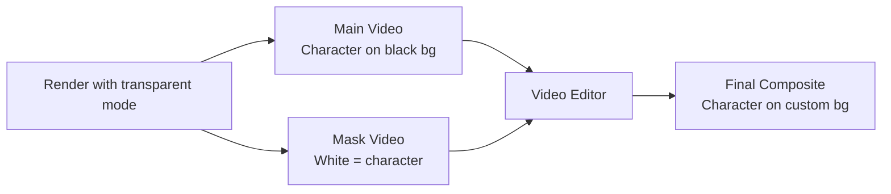

When you render with `background_mode=transparent`, the API generates two outputs:

- **Main video**: Character rendered on a black background
- **Mask video**: Grayscale video where white pixels represent the character and black pixels represent the background

Use both files together in your video editor to composite the character onto any background.

## How It Works



## Step 1: Render with Transparent Mode

<CodeGroup>

```python Python
import requests

API_KEY = "YOUR_API_KEY"
BASE = "https://api.viggle.ai"
headers = {"Authorization": f"Bearer {API_KEY}"}

job = requests.post(f"{BASE}/api/render", headers=headers, data={
    "character_id": "char_xxx",
    "scene_id": "scene_xxx",
    "background_mode": "transparent",
    "resolution": "1080p",
}).json()

print(f"Job ID: {job['job_id']}")
```

```bash cURL
curl -X POST "https://api.viggle.ai/api/render" \
  -H "Authorization: Bearer YOUR_API_KEY" \
  -d "character_id=char_xxx" \
  -d "scene_id=scene_xxx" \
  -d "background_mode=transparent" \
  -d "resolution=1080p"
```

</CodeGroup>

## Step 2: Wait and Check for Mask URL

When the job completes, the response includes both the main video URL and the mask video URL.

```python Python
import time

while True:
    status = requests.get(f"{BASE}/api/render/{job['job_id']}").json()
    if status["status"] == "complete":
        print(f"Video:  {status['cdn_url']}")
        print(f"Mask:   {status['mask_cdn_url']}")
        print(f"Download mask: {status['mask_download_url']}")
        break
    elif status["status"] == "failed":
        raise Exception(status.get("error"))
    time.sleep(5)
```

**Example response when complete:**

```json
{
  "job_id": "job_abc123xyz",
  "status": "complete",
  "cdn_url": "https://cdn.viggle.ai/videos/job_abc123xyz/output.mp4",
  "mask_cdn_url": "https://cdn.viggle.ai/videos/job_abc123xyz/output_mask.mp4",
  "mask_download_url": "/api/render/job_abc123xyz/download/mask",
  "progress": { "completed_chunks": 5, "total_chunks": 5, "percent": 100.0 }
}
```

## Step 3: Download Both Files

<CodeGroup>

```python Python
# Download main video
video = requests.get(
    f"{BASE}/api/render/{job['job_id']}/download",
    headers=headers
)
with open("character.mp4", "wb") as f:
    f.write(video.content)

# Download mask video
mask = requests.get(
    f"{BASE}/api/render/{job['job_id']}/download/mask",
    headers=headers
)
with open("character_mask.mp4", "wb") as f:
    f.write(mask.content)

print("Downloaded character.mp4 and character_mask.mp4")
```

```bash cURL
# Download main video
curl -L "https://api.viggle.ai/api/render/JOB_ID/download" \
  -H "Authorization: Bearer YOUR_API_KEY" \
  -o character.mp4

# Download mask video
curl -L "https://api.viggle.ai/api/render/JOB_ID/download/mask" \
  -H "Authorization: Bearer YOUR_API_KEY" \
  -o character_mask.mp4
```

</CodeGroup>

## Step 4: Composite in Your Editor

### After Effects

1. Import both `character.mp4` and `character_mask.mp4`
2. Place `character.mp4` on a layer above your background
3. Add `character_mask.mp4` as a **Track Matte** (Luma Matte) for the character layer
4. The character will now appear composited over your custom background

### DaVinci Resolve

1. Place your background on V1 and `character.mp4` on V2
2. Add `character_mask.mp4` to the Fusion page as an alpha input
3. Use the **MatteControl** node to apply the mask

### FFmpeg (Programmatic)

Composite the character onto a custom background using ffmpeg:

```bash
ffmpeg -i background.mp4 -i character.mp4 -i character_mask.mp4 \
  -filter_complex "[2:v]format=gray[mask];[1:v][mask]alphamerge[fg];[0:v][fg]overlay=0:0" \
  -c:v libx264 -preset fast \
  composited_output.mp4
```

## Complete Script

```python Python
import requests
import time

API_KEY = "YOUR_API_KEY"
BASE = "https://api.viggle.ai"
headers = {"Authorization": f"Bearer {API_KEY}"}

# 1. Create transparent render
job = requests.post(f"{BASE}/api/render", headers=headers, data={
    "character_id": "char_xxx",
    "scene_id": "scene_xxx",
    "background_mode": "transparent",
}).json()
print(f"Job: {job['job_id']}")

# 2. Wait for completion
while True:
    status = requests.get(f"{BASE}/api/render/{job['job_id']}").json()
    if status["status"] == "complete":
        break
    elif status["status"] == "failed":
        raise Exception(status.get("error"))
    time.sleep(5)

# 3. Download video + mask
for endpoint, filename in [("download", "character.mp4"), ("download/mask", "character_mask.mp4")]:
    resp = requests.get(f"{BASE}/api/render/{job['job_id']}/{endpoint}", headers=headers)
    with open(filename, "wb") as f:
        f.write(resp.content)
    print(f"Saved {filename}")

print("Ready for compositing!")
```

## Tips

<AccordionGroup>
  <Accordion title="Use 1080p for best compositing quality">
    Set `resolution=1080p` to get the highest quality output for compositing workflows where detail matters.
  </Accordion>

  <Accordion title="Mask dilation for edge cleanup">
    If you see artifacts at character edges, increase `mask_dilation` (try 3-5) to expand the mask boundary slightly.
  </Accordion>

  <Accordion title="Green screen alternative">
    If your editor supports chroma keying, you can use `background_mode=solid` with `bg_color=0,255,0` instead. This gives you a traditional green screen without needing a separate mask file.
  </Accordion>
</AccordionGroup>
