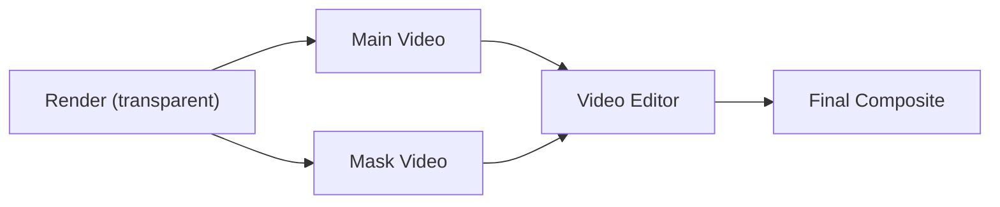

Render with `background_mode=transparent` to get a main video + mask video for compositing onto any background.


```mermaid
graph LR
    A["Render (transparent)"] --> B[Main Video]
    A --> C[Mask Video]
    B --> D[Video Editor]
    C --> D
    D --> E[Final Composite]
```

## Workflow

<Steps>
  <Step title="Render with transparent mode" icon="play">
    <CodeGroup>

    ```python Python
    import requests, time
    API_KEY, BASE = "YOUR_API_KEY", "https://apis.viggle.ai"
    headers = {"Authorization": f"Bearer {API_KEY}"}

    job = requests.post(f"{BASE}/api/render", headers=headers, data={
        "character_id": "char_xxx",
        "scene_id": "scene_xxx",
        "background_mode": "transparent",
    }).json()
    print(f"Job ID: {job['job_id']}")
    ```

    ```javascript JavaScript
    const API_KEY = "YOUR_API_KEY", BASE = "https://apis.viggle.ai";
    const headers = { Authorization: `Bearer ${API_KEY}` };

    const form = new URLSearchParams();
    form.append("character_id", "char_xxx");
    form.append("scene_id", "scene_xxx");
    form.append("background_mode", "transparent");

    const job = await fetch(`${BASE}/api/render`, {
      method: "POST", headers, body: form
    }).then(r => r.json());
    console.log(`Job ID: ${job.job_id}`);
    ```

    ```bash cURL
    curl -X POST "https://apis.viggle.ai/api/render" \
      -H "Authorization: Bearer YOUR_API_KEY" \
      -d "character_id=char_xxx" -d "scene_id=scene_xxx" \
      -d "background_mode=transparent"
    ```

    </CodeGroup>
  </Step>

  <Step title="Poll for completion" icon="clock">
    Poll the status endpoint until complete. The response includes both `cdn_url` and `mask_cdn_url`.

    <CodeGroup>

    ```python Python
    while True:
        status = requests.get(
            f"{BASE}/api/render/{job['job_id']}/poll",
            headers=headers
        ).json()
        if status["status"] == "complete":
            print(f"Video: {status['cdn_url']}")
            print(f"Mask:  {status['mask_cdn_url']}")
            break
        elif status["status"] == "failed": raise Exception(status.get("error"))
        time.sleep(5)
    ```

    ```javascript JavaScript
    const sleep = (ms) => new Promise(r => setTimeout(r, ms));
    while (true) {
      const status = await fetch(
        `${BASE}/api/render/${job.job_id}/poll`,
        { headers }
      ).then(r => r.json());
      if (status.status === "complete") {
        console.log(`Video: ${status.cdn_url}`);
        console.log(`Mask:  ${status.mask_cdn_url}`);
        break;
      }
      if (status.status === "failed") throw new Error(status.error);
      await sleep(5000);
    }
    ```

    ```bash cURL
    curl -s "https://apis.viggle.ai/api/render/JOB_ID/poll" \
      -H "Authorization: Bearer YOUR_API_KEY"
    # Response includes: "cdn_url" and "mask_cdn_url"
    ```

    </CodeGroup>
  </Step>

  <Step title="Download both files" icon="download">
    Use the CDN URLs from the poll response to download the video and mask.

    <CodeGroup>

    ```python Python
    import urllib.request
    for url, filename in [
        (status["cdn_url"], "character.mp4"),
        (status["mask_cdn_url"], "character_mask.mp4"),
    ]:
        urllib.request.urlretrieve(url, filename)
        print(f"Saved {filename}")
    ```

    ```javascript JavaScript
    const fs = require("fs");
    for (const [url, filename] of [
      [status.cdn_url, "character.mp4"],
      [status.mask_cdn_url, "character_mask.mp4"],
    ]) {
      const resp = await fetch(url);
      fs.writeFileSync(filename, Buffer.from(await resp.arrayBuffer()));
      console.log(`Saved ${filename}`);
    }
    ```

    ```bash cURL
    # Use cdn_url and mask_cdn_url from the poll response
    curl -L -o character.mp4 "CDN_URL_FROM_POLL"
    curl -L -o character_mask.mp4 "MASK_CDN_URL_FROM_POLL"
    ```

    </CodeGroup>
  </Step>

  <Step title="Composite in your editor" icon="film">
    <Tabs>
      <Tab title="After Effects">
        1. Import `character.mp4` and `character_mask.mp4`
        2. Place `character.mp4` above your background layer
        3. Add `character_mask.mp4` as a **Track Matte** (Luma Matte)
        4. Character composites over your custom background
      </Tab>
      <Tab title="DaVinci Resolve">
        1. Place background on V1, `character.mp4` on V2
        2. Add `character_mask.mp4` in Fusion as alpha input
        3. Use **MatteControl** node to apply the mask
      </Tab>
      <Tab title="FFmpeg">
        ```bash
        ffmpeg -i background.mp4 -i character.mp4 -i character_mask.mp4 \
          -filter_complex "[2:v]format=gray[mask];[1:v][mask]alphamerge[fg];[0:v][fg]overlay=0:0" \
          -c:v libx264 -preset fast composited_output.mp4
        ```
      </Tab>
    </Tabs>
  </Step>
</Steps>

## Complete script

<Accordion title="Full end-to-end script">
  <CodeGroup>

  ```python Python
  import requests, time, urllib.request

  API_KEY, BASE = "YOUR_API_KEY", "https://apis.viggle.ai"
  headers = {"Authorization": f"Bearer {API_KEY}"}

  # 1. Start transparent render
  job = requests.post(f"{BASE}/api/render", headers=headers, data={
      "character_id": "char_xxx", "scene_id": "scene_xxx",
      "background_mode": "transparent",
  }).json()

  # 2. Poll until complete
  while True:
      status = requests.get(f"{BASE}/api/render/{job['job_id']}/poll", headers=headers).json()
      if status["status"] == "complete": break
      elif status["status"] == "failed": raise Exception(status.get("error"))
      time.sleep(5)

  # 3. Download video and mask via CDN URLs
  for url, filename in [
      (status["cdn_url"], "character.mp4"),
      (status["mask_cdn_url"], "character_mask.mp4"),
  ]:
      urllib.request.urlretrieve(url, filename)
      print(f"Saved {filename}")
  ```

  ```javascript JavaScript
  const fs = require("fs");

  const API_KEY = "YOUR_API_KEY", BASE = "https://apis.viggle.ai";
  const headers = { Authorization: `Bearer ${API_KEY}` };
  const sleep = (ms) => new Promise(r => setTimeout(r, ms));

  // 1. Start transparent render
  const form = new URLSearchParams();
  form.append("character_id", "char_xxx");
  form.append("scene_id", "scene_xxx");
  form.append("background_mode", "transparent");

  const job = await fetch(`${BASE}/api/render`, {
    method: "POST", headers, body: form
  }).then(r => r.json());

  // 2. Poll until complete
  let status;
  while (true) {
    status = await fetch(`${BASE}/api/render/${job.job_id}/poll`, { headers }).then(r => r.json());
    if (status.status === "complete") break;
    if (status.status === "failed") throw new Error(status.error);
    await sleep(5000);
  }

  // 3. Download video and mask via CDN URLs
  for (const [url, filename] of [
    [status.cdn_url, "character.mp4"],
    [status.mask_cdn_url, "character_mask.mp4"],
  ]) {
    const resp = await fetch(url);
    fs.writeFileSync(filename, Buffer.from(await resp.arrayBuffer()));
    console.log(`Saved ${filename}`);
  }
  ```

  ```bash cURL
  #!/bin/bash
  # Full compositing workflow (requires jq)
  API_KEY="YOUR_API_KEY"
  BASE="https://apis.viggle.ai"

  # 1. Start transparent render
  JOB_ID=$(curl -s -X POST "$BASE/api/render" \
    -H "Authorization: Bearer $API_KEY" \
    -d "character_id=char_xxx" -d "scene_id=scene_xxx" \
    -d "background_mode=transparent" | jq -r '.job_id')
  echo "Job: $JOB_ID"

  # 2. Poll until complete
  while true; do
    RESULT=$(curl -s "$BASE/api/render/$JOB_ID/poll" -H "Authorization: Bearer $API_KEY")
    STATUS=$(echo "$RESULT" | jq -r '.status')
    [ "$STATUS" = "complete" ] && break
    [ "$STATUS" = "failed" ] && echo "Failed!" && exit 1
    sleep 5
  done

  # 3. Download video and mask via CDN URLs
  curl -sL -o character.mp4 "$(echo "$RESULT" | jq -r '.cdn_url')"
  curl -sL -o character_mask.mp4 "$(echo "$RESULT" | jq -r '.mask_cdn_url')"
  echo "Saved character.mp4 and character_mask.mp4"
  ```

  </CodeGroup>
</Accordion>

## Tips

<Accordion title="Green screen alternative">
  If your editor supports chroma keying, use `background_mode=solid` with `bg_color=0,255,0` instead. Traditional green screen without a separate mask file.
</Accordion>
