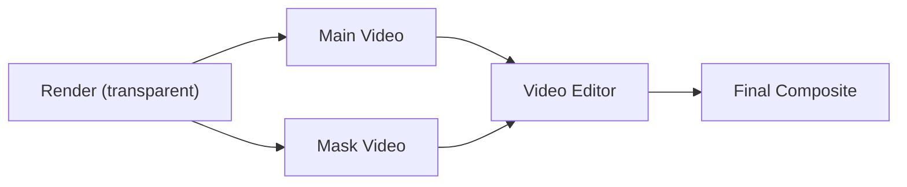

Render with `background_mode=transparent` to get a main video + mask video for compositing onto any background.


```mermaid
graph LR
    A["Render (transparent)"] --> B[Main Video]
    A --> C[Mask Video]
    B --> D[Video Editor]
    C --> D
    D --> E[Final Composite]
```

## Workflow

<Steps>
  <Step title="Render with transparent mode" icon="play">
    <CodeGroup>

    ```python Python
    import requests, time
    API_KEY, BASE = "YOUR_API_KEY", "https://apis.viggle.ai"
    headers = {"Authorization": f"Bearer {API_KEY}"}

    job = requests.post(f"{BASE}/api/render", headers=headers, data={
        "character_id": "char_xxx",
        "scene_id": "scene_xxx",
        "background_mode": "transparent",
    }).json()
    print(f"Job ID: {job['job_id']}")
    ```

    ```bash cURL
    curl -X POST "https://apis.viggle.ai/api/render" \
      -H "Authorization: Bearer YOUR_API_KEY" \
      -d "character_id=char_xxx" -d "scene_id=scene_xxx" \
      -d "background_mode=transparent"
    ```

    </CodeGroup>
  </Step>

  <Step title="Wait and download" icon="clock">
    Poll until complete, then download the video and mask from the CDN URLs in the status response.

    ```python
    while True:
        status = requests.get(f"{BASE}/api/render/{job['job_id']}").json()
        if status["status"] == "complete":
            print(f"Video: {status['cdn_url']}")
            break
        elif status["status"] == "failed": raise Exception(status.get("error_message"))
        time.sleep(3)

    # Download main video
    video = requests.get(status["cdn_url"])
    open("character.mp4", "wb").write(video.content)
    ```
  </Step>

  <Step title="Composite in your editor" icon="film">
    <Tabs>
      <Tab title="After Effects">
        1. Import `character.mp4` and the mask video
        2. Place `character.mp4` above your background layer
        3. Add the mask as a **Track Matte** (Luma Matte)
        4. Character composites over your custom background
      </Tab>
      <Tab title="DaVinci Resolve">
        1. Place background on V1, `character.mp4` on V2
        2. Add the mask video in Fusion as alpha input
        3. Use **MatteControl** node to apply the mask
      </Tab>
      <Tab title="FFmpeg">
        ```bash
        ffmpeg -i background.mp4 -i character.mp4 -i character_mask.mp4 \
          -filter_complex "[2:v]format=gray[mask];[1:v][mask]alphamerge[fg];[0:v][fg]overlay=0:0" \
          -c:v libx264 -preset fast composited_output.mp4
        ```
      </Tab>
    </Tabs>
  </Step>
</Steps>

## Complete script

<Accordion title="Full Python script">
  ```python
  import requests, time

  API_KEY, BASE = "YOUR_API_KEY", "https://apis.viggle.ai"
  headers = {"Authorization": f"Bearer {API_KEY}"}

  job = requests.post(f"{BASE}/api/render", headers=headers, data={
      "character_id": "char_xxx", "scene_id": "scene_xxx",
      "background_mode": "transparent",
  }).json()

  while True:
      status = requests.get(f"{BASE}/api/render/{job['job_id']}").json()
      if status["status"] == "complete": break
      elif status["status"] == "failed": raise Exception(status.get("error_message"))
      time.sleep(3)

  video = requests.get(status["cdn_url"])
  open("character.mp4", "wb").write(video.content)
  print(f"Saved character.mp4")
  ```
</Accordion>

## Tips

<Accordion title="Green screen alternative">
  If your editor supports chroma keying, use `background_mode=solid` with `bg_color=0,255,0` instead. Traditional green screen without a separate mask file.
</Accordion>
