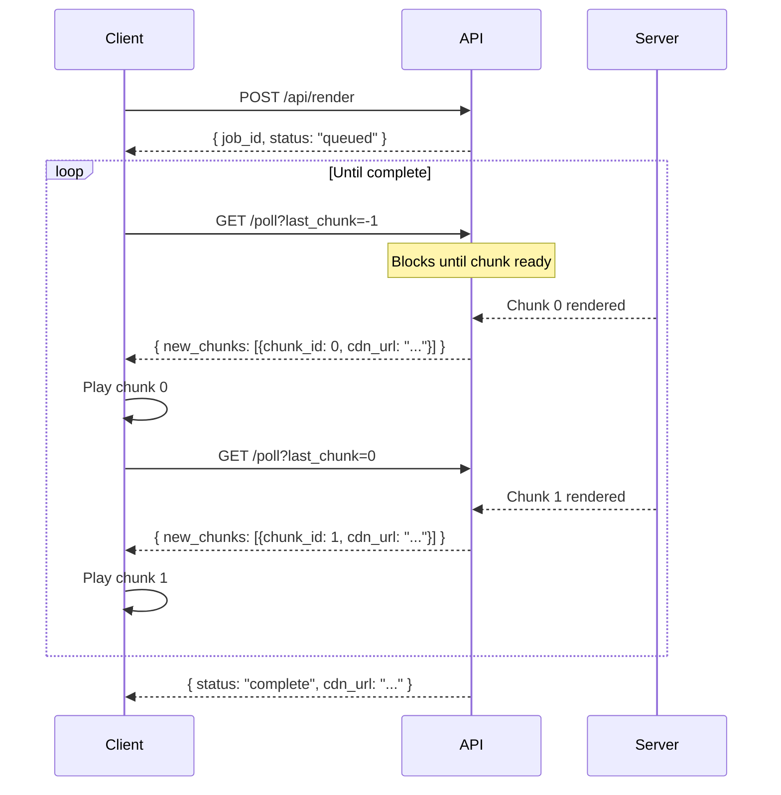

Live rendering lets you receive and play video chunks as they're generated, instead of waiting for the full video to complete. This is ideal for real-time previews and streaming applications.

## How It Works

Instead of polling the status endpoint and downloading at the end, you use the **Poll endpoint** which blocks until new chunks are ready:



## Basic Example

<CodeGroup>

```python Python
import requests

API_KEY = "YOUR_API_KEY"
BASE = "https://apis.viggle.ai"
headers = {"Authorization": f"Bearer {API_KEY}"}

# 1. Create render job
job = requests.post(f"{BASE}/api/render", headers=headers, data={
    "character_id": "char_xxx",
    "scene_id": "scene_xxx",
}).json()
print(f"Job: {job['job_id']}")

# 2. Long-poll for chunks
last_chunk = -1
all_chunks = []

while True:
    resp = requests.get(
        f"{BASE}/api/render/{job['job_id']}/poll",
        headers=headers,
        params={"last_chunk": last_chunk, "timeout": 30}
    ).json()

    # Process new chunks as they arrive
    for chunk in resp["new_chunks"]:
        print(f"  Chunk {chunk['chunk_id']} ready: {chunk['cdn_url']}")
        all_chunks.append(chunk)
        last_chunk = max(last_chunk, chunk["chunk_id"])

    if resp["status"] == "complete":
        print(f"Complete! Full video: {resp['cdn_url']}")
        break
    elif resp["status"] == "failed":
        raise Exception(resp.get("error"))
```

```javascript JavaScript
const API_KEY = "YOUR_API_KEY";
const BASE = "https://apis.viggle.ai";
const headers = { "Authorization": `Bearer ${API_KEY}` };

// 1. Create render job
const form = new URLSearchParams();
form.append("character_id", "char_xxx");
form.append("scene_id", "scene_xxx");

const job = await fetch(`${BASE}/api/render`, {
  method: "POST", headers, body: form
}).then(r => r.json());

// 2. Long-poll for chunks
let lastChunk = -1;

while (true) {
  const resp = await fetch(
    `${BASE}/api/render/${job.job_id}/poll?last_chunk=${lastChunk}&timeout=30`,
    { headers }
  ).then(r => r.json());

  for (const chunk of resp.new_chunks) {
    console.log(`Chunk ${chunk.chunk_id}: ${chunk.cdn_url}`);
    lastChunk = Math.max(lastChunk, chunk.chunk_id);

    // Play chunk in video element
    // videoElement.src = chunk.cdn_url;
  }

  if (resp.status === "complete") {
    console.log(`Done! Full video: ${resp.cdn_url}`);
    break;
  }
  if (resp.status === "failed") throw new Error(resp.error);
}
```

</CodeGroup>

## Progressive Playback in Browser

Play chunks sequentially using MediaSource API for seamless progressive playback:

```javascript
const videoEl = document.getElementById('preview');

async function streamRender(jobId) {
  const headers = { "Authorization": `Bearer ${API_KEY}` };
  let lastChunk = -1;

  while (true) {
    const resp = await fetch(
      `${BASE}/api/render/${jobId}/poll?last_chunk=${lastChunk}&timeout=30`,
      { headers }
    ).then(r => r.json());

    // Download and queue each chunk for playback
    for (const chunk of resp.new_chunks) {
      const chunkData = await fetch(chunk.cdn_url).then(r => r.blob());
      const url = URL.createObjectURL(chunkData);

      // Append to playlist or update source
      lastChunk = Math.max(lastChunk, chunk.chunk_id);
    }

    if (resp.status === "complete") {
      // Switch to final merged video for clean playback
      videoEl.src = resp.cdn_url;
      break;
    }
    if (resp.status === "failed") {
      console.error("Render failed:", resp.error);
      break;
    }
  }
}
```

## Poll vs Status: When to Use Which

| Feature | Poll (`/poll`) | Status (`/`) |
|---------|----------------|--------------|
| **Auth required** | Yes | No |
| **Blocking** | Yes (long-poll up to 60s) | No (returns immediately) |
| **Returns chunks** | New chunks since `last_chunk` | All completed chunks |
| **Best for** | Real-time streaming, progressive playback | Background polling, simple integration |
| **Latency** | Low (returns as soon as chunk is ready) | 5s polling interval |

## Tips

<AccordionGroup>
  <Accordion title="Set appropriate timeouts">
    The `timeout` parameter (default 30s, max 60s) controls how long the server holds your request. Set your HTTP client timeout higher than this value to avoid premature disconnections.

    ```python
    # Set requests timeout higher than poll timeout
    resp = requests.get(url, params={"timeout": 30}, timeout=45)
    ```
  </Accordion>

  <Accordion title="Handle reconnection gracefully">
    If the connection drops, simply resume polling with the last received `chunk_id`. The API is stateless - you won't miss any chunks.
  </Accordion>

  <Accordion title="Use fast mode for lower latency">
    Enable `fast=true` when creating the job for faster rendering, reducing the time between chunks.
  </Accordion>
</AccordionGroup>
