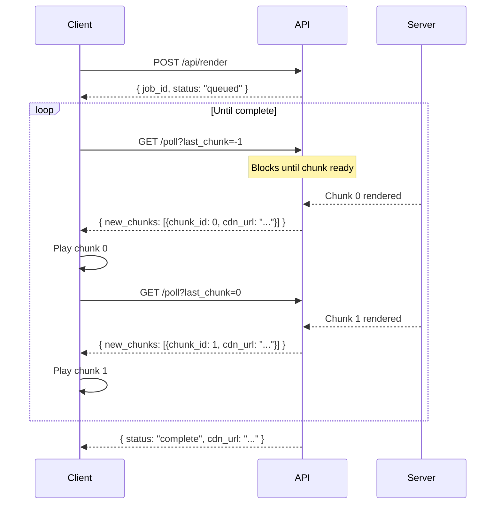

Live rendering lets you receive and play video chunks as they're generated, instead of waiting for the full video to complete. This is ideal for real-time previews and streaming applications.

## How It Works

Instead of polling the status endpoint and downloading at the end, you use the **Poll endpoint** which blocks until new chunks are ready:


```mermaid
sequenceDiagram
    participant Client
    participant API
    participant Server

    Client->>API: POST /api/render
    API-->>Client: { job_id, status: "queued" }

    loop Until complete
        Client->>API: GET /poll?last_chunk=-1
        Note over API: Blocks until chunk ready
        Server-->>API: Chunk 0 rendered
        API-->>Client: { new_chunks: [{chunk_id: 0, cdn_url: "..."}] }
        Client->>Client: Play chunk 0

        Client->>API: GET /poll?last_chunk=0
        Server-->>API: Chunk 1 rendered
        API-->>Client: { new_chunks: [{chunk_id: 1, cdn_url: "..."}] }
        Client->>Client: Play chunk 1
    end

    API-->>Client: { status: "complete", cdn_url: "..." }
```

## Basic Example

<CodeGroup>

```python Python
import requests

API_KEY = "YOUR_API_KEY"
BASE = "https://apis.viggle.ai"
headers = {"Authorization": f"Bearer {API_KEY}"}

# 1. Create render job
job = requests.post(f"{BASE}/api/render", headers=headers, data={
    "character_id": "char_xxx",
    "scene_id": "scene_xxx",
}).json()
print(f"Job: {job['job_id']}")

# 2. Long-poll for chunks
last_chunk = -1
all_chunks = []

while True:
    resp = requests.get(
        f"{BASE}/api/render/{job['job_id']}/poll",
        headers=headers,
        params={"last_chunk": last_chunk, "timeout": 30}
    ).json()

    # Process new chunks as they arrive
    for chunk in resp["new_chunks"]:
        print(f"  Chunk {chunk['chunk_id']} ready: {chunk['cdn_url']}")
        all_chunks.append(chunk)
        last_chunk = max(last_chunk, chunk["chunk_id"])

    if resp["status"] == "complete":
        print(f"Complete! Full video: {resp['cdn_url']}")
        break
    elif resp["status"] == "failed":
        raise Exception(resp.get("error"))
```

```javascript JavaScript
const API_KEY = "YOUR_API_KEY";
const BASE = "https://apis.viggle.ai";
const headers = { "Authorization": `Bearer ${API_KEY}` };

// 1. Create render job
const form = new URLSearchParams();
form.append("character_id", "char_xxx");
form.append("scene_id", "scene_xxx");

const job = await fetch(`${BASE}/api/render`, {
  method: "POST", headers, body: form
}).then(r => r.json());

// 2. Long-poll for chunks
let lastChunk = -1;

while (true) {
  const resp = await fetch(
    `${BASE}/api/render/${job.job_id}/poll?last_chunk=${lastChunk}&timeout=30`,
    { headers }
  ).then(r => r.json());

  for (const chunk of resp.new_chunks) {
    console.log(`Chunk ${chunk.chunk_id}: ${chunk.cdn_url}`);
    lastChunk = Math.max(lastChunk, chunk.chunk_id);

    // Play chunk in video element
    // videoElement.src = chunk.cdn_url;
  }

  if (resp.status === "complete") {
    console.log(`Done! Full video: ${resp.cdn_url}`);
    break;
  }
  if (resp.status === "failed") throw new Error(resp.error);
}
```

</CodeGroup>

## Progressive Playback with fMP4 + MSE

Each chunk is a **fragmented MP4** (fMP4) file with `empty_moov` + `moof`/`mdat` fragment pairs. This means chunks can be fed directly into the browser's [Media Source Extensions (MSE)](https://developer.mozilla.org/en-US/docs/Web/API/Media_Source_Extensions_API) API for seamless, gapless playback as they arrive.

<Info>
  See [fMP4 Format Specification](/guides/fmp4-format) for details on the chunk file structure.
</Info>

### Poll-Based MSE Player

```javascript
const video = document.getElementById("player");
const mime = 'video/mp4; codecs="avc1.64001f"';

async function streamWithMSE(jobId) {
  const headers = { Authorization: `Bearer ${API_KEY}` };
  const mediaSource = new MediaSource();
  video.src = URL.createObjectURL(mediaSource);

  await new Promise(r => mediaSource.addEventListener("sourceopen", r, { once: true }));
  const sourceBuffer = mediaSource.addSourceBuffer(mime);

  let lastChunk = -1;
  const queue = [];
  let appending = false;

  function drainQueue() {
    if (appending || queue.length === 0) return;
    appending = true;
    sourceBuffer.appendBuffer(queue.shift());
  }

  sourceBuffer.addEventListener("updateend", () => {
    appending = false;
    drainQueue();
  });

  while (true) {
    const resp = await fetch(
      `${BASE}/api/render/${jobId}/poll?last_chunk=${lastChunk}&timeout=30`,
      { headers }
    ).then(r => r.json());

    for (const chunk of resp.new_chunks) {
      const buf = await fetch(chunk.cdn_url).then(r => r.arrayBuffer());
      queue.push(buf);
      drainQueue();
      lastChunk = Math.max(lastChunk, chunk.chunk_id);
    }

    // Auto-play once first chunk is buffered
    if (video.paused && sourceBuffer.buffered.length > 0) {
      video.play();
    }

    if (resp.status === "complete") {
      // Wait for queue to drain, then signal end of stream
      const waitDrain = () => new Promise(r => {
        const check = () => (queue.length === 0 && !appending) ? r() : setTimeout(check, 50);
        check();
      });
      await waitDrain();
      mediaSource.endOfStream();
      break;
    }

    if (resp.status === "failed") {
      console.error("Render failed:", resp.error);
      break;
    }
  }
}
```

### Server-Side: Stream to File (Python)

Download fMP4 chunks as they arrive and concatenate into a single file:

```python
import requests

API_KEY = "YOUR_API_KEY"
BASE = "https://apis.viggle.ai"
headers = {"Authorization": f"Bearer {API_KEY}"}

def stream_to_file(job_id, output_path="stream.mp4"):
    last_chunk = -1

    with open(output_path, "wb") as f:
        while True:
            resp = requests.get(
                f"{BASE}/api/render/{job_id}/poll",
                headers=headers,
                params={"last_chunk": last_chunk, "timeout": 30},
                timeout=45,
            ).json()

            for chunk in resp["new_chunks"]:
                data = requests.get(chunk["cdn_url"]).content
                f.write(data)
                f.flush()
                last_chunk = max(last_chunk, chunk["chunk_id"])
                print(f"  Wrote chunk {chunk['chunk_id']} ({len(data)} bytes)")

            if resp["status"] == "complete":
                print(f"Done! Saved to {output_path}")
                break
            elif resp["status"] == "failed":
                raise Exception(resp.get("error"))
```

<Warning>
  Concatenating raw fMP4 chunks produces a playable file in most players, but for a clean final file use the download endpoint (`GET /api/render/{job_id}/download`) which returns a properly merged MP4 with `faststart` flag.
</Warning>

## fMP4 Chunk Format

Each chunk is a self-contained **fragmented MP4** (ISO BMFF) produced with:

```bash
ffmpeg -c:v copy -movflags +frag_keyframe+empty_moov+default_base_moof -f mp4
```

| Flag | Purpose |
|------|---------|
| `frag_keyframe` | New fragment at each keyframe — independently decodable |
| `empty_moov` | Empty `moov` box at start (no sample tables) — required for MSE |
| `default_base_moof` | `moof` position as base offset — required by MSE and DASH |

### Box Layout

```
ftyp          File Type (isom)
moov          Movie Box (empty — metadata only)
├─ mvhd       Movie header (timescale, duration=0)
├─ trak       Track (width, height, codec: H.264)
└─ mvex       Movie extends (trex defaults)
moof          Movie Fragment #1
├─ mfhd       Sequence number
└─ traf       Track fragment (tfhd, tfdt, trun)
mdat          Media Data #1 (H.264 NAL units)
moof + mdat   Fragment #2 ...
```

### Key Fields

| Field | Box | Description |
|-------|-----|-------------|
| `timescale` | mvhd / mdhd | Ticks per second (typically 12800 or 15360) |
| `sequence_number` | mfhd | Fragment index (1-based) |
| `base_media_decode_time` | tfdt | Presentation timestamp in timescale units |
| `sample_count` | trun | Number of video frames in this fragment |
| `sample_flags` | trun | Sync sample flag for keyframes |

### MSE Codec String

Use this codec string for `addSourceBuffer()`:

```
'video/mp4; codecs="avc1.64001f"'
```

### Verification

```bash
# Inspect box structure (Bento4)
mp4dump chunk_0.mp4

# Check streams and format
ffprobe -show_format -show_streams chunk_0.mp4
```

<Info>
  For the full specification including all box fields and concatenation details, see [fMP4 Format Specification](/guides/fmp4-format).
</Info>

## Poll vs Status: When to Use Which

| Feature | Poll (`/poll`) | Status (`/`) |
|---------|----------------|--------------|
| **Auth required** | Yes | No |
| **Blocking** | Yes (long-poll up to 60s) | No (returns immediately) |
| **Returns chunks** | New chunks since `last_chunk` | All completed chunks |
| **Best for** | Real-time streaming, progressive playback | Background polling, simple integration |
| **Latency** | Low (returns as soon as chunk is ready) | 5s polling interval |

## Tips

<AccordionGroup>
  <Accordion title="Set appropriate timeouts">
    The `timeout` parameter (default 30s, max 60s) controls how long the server holds your request. Set your HTTP client timeout higher than this value to avoid premature disconnections.

    ```python
    # Set requests timeout higher than poll timeout
    resp = requests.get(url, params={"timeout": 30}, timeout=45)
    ```
  </Accordion>

  <Accordion title="Handle reconnection gracefully">
    If the connection drops, simply resume polling with the last received `chunk_id`. The API is stateless - you won't miss any chunks.
  </Accordion>

  <Accordion title="Use fast mode for lower latency">
    Enable `fast=true` when creating the job for faster rendering, reducing the time between chunks.
  </Accordion>
</AccordionGroup>
